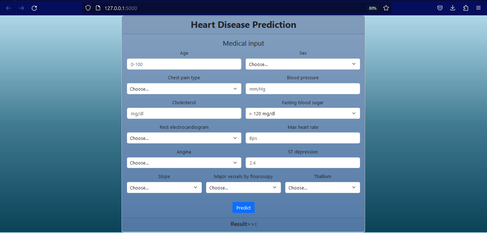

# Heart_Disease_Prediction

**Heart_Disease_Prediction** is a web application using Flask framework, python, Machine Learning and the heart disease 
dataset provided by the *UCI Machine Learning Repository*. By training our dataset, we are using 13 medical features
that allow us to predict whether or not the user is possible to have a heart disease.

## User Stories

The following functionality is completed:

- [x] User can enter the medical features.
- [x] Predict button send the medical datas to the machine learning model.
- [x] The machine learning model predict the datas and shows the result based on his model.

## Demonstration

## Open-source ressources used

- [Flask](https://flask.palletsprojects.com/en/2.2.x/)
- [UCI Machine Learning Repository](https://archive.ics.uci.edu/ml/index.php)
- [Boostrap](https://getbootstrap.com)
- [Kaggle](https://www.kaggle.com/)
